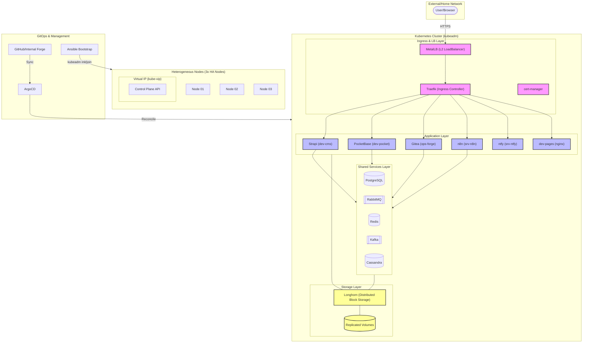

# Homelab


This repo was initially built to teach me Docker and Compose skills as part of my self-hosting and homelab journey. But it has since evolved into a Kubernetes and Ansible learning project with a focus on production-like patterns and practices.

I chose a vanilla approach with `kubeadm` instead of something like `k3s` or `talos` because I am studying for the CKA and want to understand the underlying components and processes. I also want to practice building out the cluster with Ansible and then managing it through GitOps.

## Overview

The cluster gets bootstrapped through Ansible and then fully reconciled through ArgoCD. The GitOps repo is the single source of truth for cluster state after bootstrap. Since I'm studying for the CKA, the cluster is built with `kubeadm` to stay vanilla. I use `Longhorn` for replicated block storage on local disks, `MetalLB` for as an L2 load balancer, `Calico` for networking, and the control-plane is highly available with `kube-vip`.

## Inventory Model

Inventory is defined in [playbooks/inventory](/home/marthinus/Personal/homelab/playbooks/inventory).

Each host declares:

- `ansible_host`: SSH target
- `management_ip`: node IP used by kubeadm and kubelet
- `storage_disks`: Longhorn disk paths and tags

Cluster-wide variables declare:

- `api_virtual_ip`: shared API endpoint managed by kube-vip
- `api_virtual_ip_interface`: interface advertising the VIP
- `gitops_repo_url`, `gitops_revision`, `gitops_overlay_path`: ArgoCD source of truth
- `metallb_address_pool`, `longhorn_backup_target`, `longhorn_backup_endpoint`: platform defaults

## Bootstrap Flow

1. Update the inventory with the real control-plane nodes, worker nodes, management IPs, storage disk paths, and API VIP.
2. Run the supported bootstrap playbook.
3. Wait for ArgoCD to reconcile the platform, shared services, and application layers.

```bash
ansible-playbook -i playbooks/inventory ansible/deploy-k8s.yml
```

`ansible/deploy-k8s.yml` does only three things:

- prepares the nodes and bootstraps an HA kubeadm control plane
- joins workers through the stable API VIP
- installs Calico and ArgoCD, then seeds the root application

## GitOps Layout

The GitOps entrypoint is [k8s/overlays/dev](/home/marthinus/Personal/homelab/k8s/overlays/dev).

- [k8s/base/platform](/home/marthinus/Personal/homelab/k8s/base/platform): ingress, certs, load balancing, storage, operators, RBAC, and baseline platform defaults
- [k8s/base/shared-services](/home/marthinus/Personal/homelab/k8s/base/shared-services): PostgreSQL, RabbitMQ, Redis, Kafka, and Cassandra managed through maintained charts and operators
- [k8s/base/applications](/home/marthinus/Personal/homelab/k8s/base/applications): migrated user-facing workloads, currently `dev-pages`, `srv-ntfy`, `dev-cms`, `dev-pocket`, `ops-forge`, and `srv-n8n`

The overlay creates three ArgoCD projects and three layer applications so reconciliation order is explicit.

## Platform Defaults

- MetalLB L2 pool is `192.168.1.240-192.168.1.250`
- Longhorn default replica count `3` with recurring snapshot and backup jobs
- Traefik is default ingress class with HTTPS redirect and security headers
- Cert-manager cluster issuers for self-signed bootstrap and Let’s Encrypt
- Readonly RBAC for operators and default deny network policies for shared-service and application namespaces
- Pod Disruption Budgets for Traefik, Redis, RabbitMQ, and the stateless web workloads

## Runbooks

- [docs/runbooks/node-replacement.md](/home/marthinus/Personal/homelab/docs/runbooks/node-replacement.md)
- [docs/runbooks/recovery.md](/home/marthinus/Personal/homelab/docs/runbooks/recovery.md)
- [docs/runbooks/sealed-secrets.md](/home/marthinus/Personal/homelab/docs/runbooks/sealed-secrets.md)

## Architecture

The cluster has three layers. The platform layer includes the CNI, load balancer, ingress controller, cert manager, and storage operator. The shared services layer includes databases and messaging systems used by multiple applications. The application layer includes user-facing workloads like the CMS, PocketBase, Gitea forge, n8n workflow automation, ntfy notification system, and a placeholder dev-pages nginx deployment.

